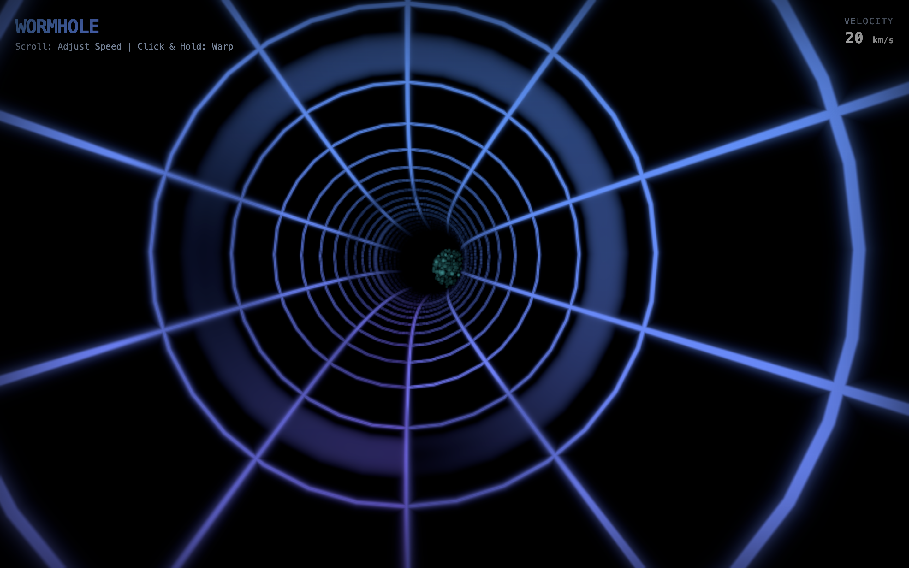

# Wormhole (Hyper-Tunnel) 🌌

A captivating, high-performance 3D space wormhole experience built with React, Three.js, and React Three Fiber. Travel endlessly through a beautifully rendered procedural spacetime tunnel featuring stellar blue and deep space purple neon effects against a stark black void.

 

## Features 🚀

- **Procedural 3D Tunnel**: Dynamically generated tubular geometry that feels infinite.
- **Hyperspeed Warp Effect**: Click and hold to trigger an intense acceleration with motion blur/bloom and chromatic aberration effects.
- **Scroll Speed Control**: Adjust your cruising velocity continuously via mouse scroll.
- **Stunning Post-Processing**: Includes custom Bloom, Depth of Field, Chromatic Aberration, and Noise to sell the deep-space aesthetic.
- **Responsive Canvas**: Smoothly scales to any device or window size using standard R3F configuration.

## Technologies Used 🛠️

- [React](https://reactjs.org/)
- [Vite](https://vitejs.dev/)
- [Three.js](https://threejs.org/)
- [React Three Fiber (@react-three/fiber)](https://docs.pmnd.rs/react-three-fiber/getting-started/introduction)
- [React Three Postprocessing (@react-three/postprocessing)](https://docs.pmnd.rs/react-three-postprocessing)
- [Tailwind CSS](https://tailwindcss.com/)

## Getting Started 🏁

### Prerequisites

You'll need Node.js installed on your local machine.

### Installation

1. Copy or clone this repository.
2. Install the dependencies:
   ```bash
   npm install
   ```
3. Run the development server:
   ```bash
   npm run dev
   ```

### Controls

- **Mouse Wheel / Scroll**: Incrementally increase or decrease base speed through the tunnel.
- **Hold Pointer (Click / Touch)**: Engage the warp-speed overdrive state for dramatic visuals. Release to decelerate back to cruising speed.

## Customization 🎨

The core shader properties of the wormhole can be easily styled from `src/components/Tunnel.tsx`. Specifically, adjust the `uColor1`, `uColor2`, and `uBgColor` uniform values to instantly change the visual scheme of the tunnel geometry.

## Assets 🖼️

Any additional assets like preview images are stored in the `/public/assets` folder. Feel free to replace `project-preview.svg` with an actual screenshot or GIF.
